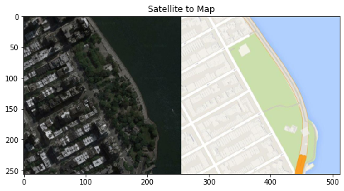
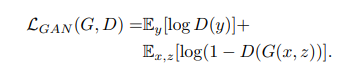
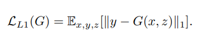
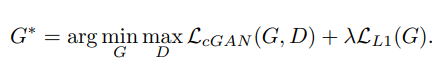
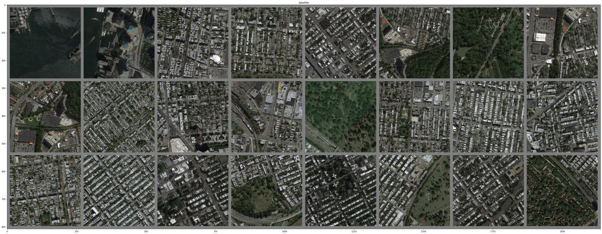
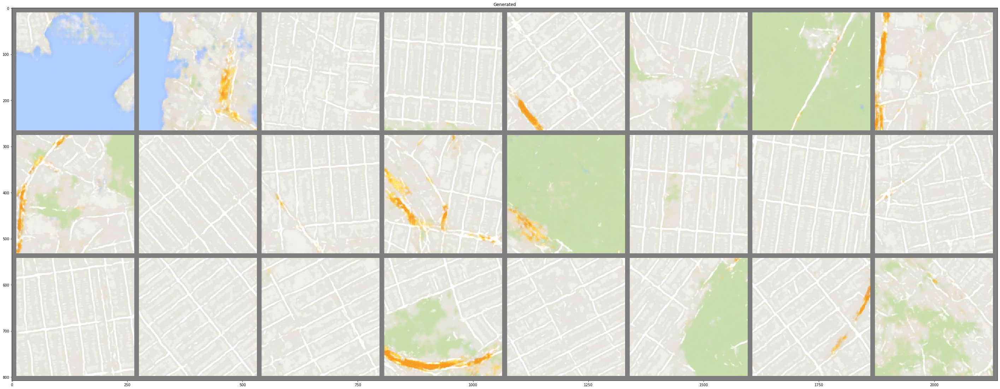

# Satellite-Imagery-to-Map-Translation-using-Pix2Pix-GAN-framework
PyTorch Implementation of Pix2Pix framework from scratch to train a U-Net with Generative Adversarial Network which translates Satellite Imagery to an equivalent Map. 
<b>Reference</b>: https://arxiv.org/abs/1611.07004 
**Sample:**  
  

# Trained Generator and Discriminator: 
* Click this link to download the trained weights for the Sat2Map Generator and Discriminator: [Download Weights](https://drive.google.com/file/d/1vvv2dXL98_M4SrjUgGps2vt1FzGRKH7B/view?usp=sharing)
* Dataset: [Download Sat2Map Dataset](https://drive.google.com/file/d/1s5a2UeJR4H_KJ-nV4NmRMkBHr3zn20Tf/view?usp=sharing)

# Hyper-parameters
As suggested by the paper in the reference, here are the values of the hyper-parameters to train the Sat2Map model: 
* Batch size: **1**
* Input and Output image size: **256 x 256**
* Learning rate: **0.0002**
* Momentum: [β1, β2] = **[0.5, 0.999]**
* λ_L1 = 100

# Ideas and Intuition of cGAN (conditional GAN)
* Original GAN trains the Generator to map a random noise **z** to the output image **G(z)** which should look as realistic as possible and trains the Discriminator to recognize the input image **x** as real/fake image based solely on the input image **x**.
* Since GAN model learns to generate image **G(z)** based only on a random noise **z**, and since we cannot easily control the distribution of **z**, it is often difficult to control the output according to our desire. GAN model only ensures that **G(z)** is realistic, but not necessarily matches our expectation. For instance, GAN Generator can be trained to map a random noise to a very realistic human face, but we cannot control the Generator to generate a white human face which look like Emma Watson.
* cGAN solves this problem by taking both the random noise **z** and the input image **x** to produce an output image **G(z|x)** which looks realistic and corresponds to **x**. Since we can control which input image **x** is fed into the network, we can control what the output image **G(z|x)** will be like. The Discriminator is trained so that **D(y|x)=1** if **y** is BOTH realistic and correspond to **x**; on the other hand, **D(y|x)=0** if **y** is either unrealistic or unrelated to input **x** or neither. This forces the Generator to learn to generate output **G(z|x)** that is both realistic and capture the overall distribution of input **x** and makes the image translation task possible.
# Generator Architecture - U-Net
* Reference: https://arxiv.org/abs/1505.04597
* Instead of mapping a random noise to an image, the Generator maps an image to another representation of the same image. This is image translation task, and that's why the framework was named "Pix2Pix".
* The neural architecture that the Generator uses is the U-Net, which is basically Encoder-Decoder with skip connections between layers in the Encoder and corresponding layers in the Decoder.
* Architecture of the U-Net: 
 
* The architecture above is the U-Net 572. What I used in this project is U-Net 256. The only difference is the input image size and the output image size.
* Function: 
  - The Encoder is the convolutional layers to the left of the network. The role of those layers is to extract core features of the image and map those features to the bottlekneck latent space at the middle of the network (an 1024-D array). This latent space is the encoded form which contains the most important information of the input image.
  - The Decoder is the transpose convolutional layers to the right of the network. Those layers map encoded latent space of the image back to a full-size image. Those layers do not simply output the same input image, but they are trained to map the encoded features to an image with another representation. For instance, the Encoder encodes the information of a Dog photo, and then the Decoder maps the encoded information of the dog to a drawing of the same dog. Both input and output have the same information: a dog, but they have different representation: a photo and a drawing. 
  - To make training more stable, extracted information from the Encoder network was concantenated to corresponding layers in the Decoder network. This ensures that the Decoder has sufficient information to map the latent space to a realistic image.
  - Since the Encoder and Decoder was in the same network, we can train U-Net end-to-end.

# Discriminator Architecture - Convolutional Neural Network
* In Pix2Pix and in cGAN, Discriminator is still a binary Convolutional Neural Network.
* The difference between Discriminator in Pix2Pix with that in the original GAN is that the Discriminator in Pix2Pix not only takes the examined image **y** but also the conditional image **x** as the inputs. In other words, **x** was concatenated to **y** as an input before feeding into the network, and the input now have 6 channels (3 for the examined image and 3 for the conditional image) instead of 3 channels.

# Loss Function
* Now we define the Objective for the training process.
* In Image translation task, the GAN training scheme is almost the same as the original GAN, except now we have conditional input and an additional L1 loss to ensure the generated image is not too different from the expected output.
* **GAN Loss**: 
 
Just like original GAN, optimizing this Loss will forces the Generator to produce results with overall distribution close to that of the image representation in the dataset and thus improve the structural quality of the Generator's output. 
* **L1 Loss**: 
 
By using pixel-wise loss between 2 images, this loss forces the output image to be as close to the expected output as possible. In other words, it improves the minor details of the output. 
* **Final Loss:** 
 
We simply combine GAN loss and L1 Loss to have the final Loss for the entire algorithm.

# Results
* The image patch with 24 samples below shows the results of the Sat2Map Generator. 
* Satellite imagery (input): 
 
* Map Representation (output):  
  
  
* The Generator successfully learned to capture main structures in satellite imagery such as roads, buildings, forests, rivers, seas, etc, map those structures to an encoded vector, and then map the encoded vector back to a full image with map representation.

# Other applications
* Pix2Pix GAN framework is a common framework for any image translation task. The algorithm I implemented above was trained specifically to translate Satellite Imagery to Map image. If you have access to other image translation dataset, you only need to retrain the model to have another Generator which translate other types of image. Some examples are Photos to Drawings, Drawings to Photos, B&W images to Colored Images, Photos to Cartoon, Photos to Anime, etc.
