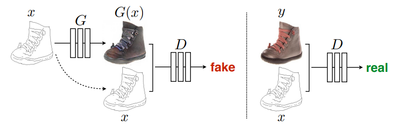

# Satellite-Imagery-to-Map-Translation-using-Pix2Pix-GAN-framework
PyTorch Implementation of Pix2Pix framework from scratch to train a U-Net with Generative Adversarial Network which translates Satellite Imagery to an equivalent Map. 
<b>Reference</b>: https://arxiv.org/abs/1611.07004

# Trained Generator and Discriminator: 
Click this link to download the trained weights for the Sat2Map Generator and Discriminator: [Download Weights](https://drive.google.com/file/d/1vvv2dXL98_M4SrjUgGps2vt1FzGRKH7B/view?usp=sharing)

# Hyper-parameters
As suggested by the paper in the reference, here are the values of the hyper-parameters to train the Sat2Map model: 
* Batch size: **1**
* Input and Output image size: **256 x 256**
* Learning rate: **0.0002**
* Momentum: [β1, β2] = **[0.5, 0.999]**
* λ_L1 = 100

# Ideas and Intuition of cGAN (conditional GAN)
* Original GAN trains the Generator to map a random noise **z** to the output image **G(z)** which should look as realistic as possible and trains the Discriminator to recognize the input image **x** as real/fake image based solely on the input image **x**.
* Since GAN model learns to generate image **G(z)** based only on a random noise **z**, and since we cannot easily control the distribution of **z**, it is often difficult to control the output according to our desire. GAN model only ensures that **G(z)** is realistic, but not necessarily matches our expectation. For instance, GAN Generator can be trained to map a random noise to a very realistic human face, but we cannot control the Generator to generate a white human face which look like Emma Watson.
* cGAN solves this problem by taking both the random noise **z** and the input image **x** to produce an output image **G(z|x)** which looks realistic and corresponds to **x**. Since we can control which input image **x** is fed into the network, we can control what the output image **G(z|x)** will be like. The Discriminator is trained so that **D(y|x)=1** if **y** is BOTH realistic and correspond to **x**; on the other hand, **D(y|x)=0** if **y** is either unrealistic or unrelated to input **x** or neither. This forces the Generator to learn to generate output **G(z|x)** that is both realistic and capture the overall distribution of input **x** and makes the image translation task possible. 
 

# Generator Architecture - U-Net
* Reference: https://arxiv.org/abs/1505.04597

# Discriminator Architecture - Convolutional Neural Network

# Loss Function

# Results
